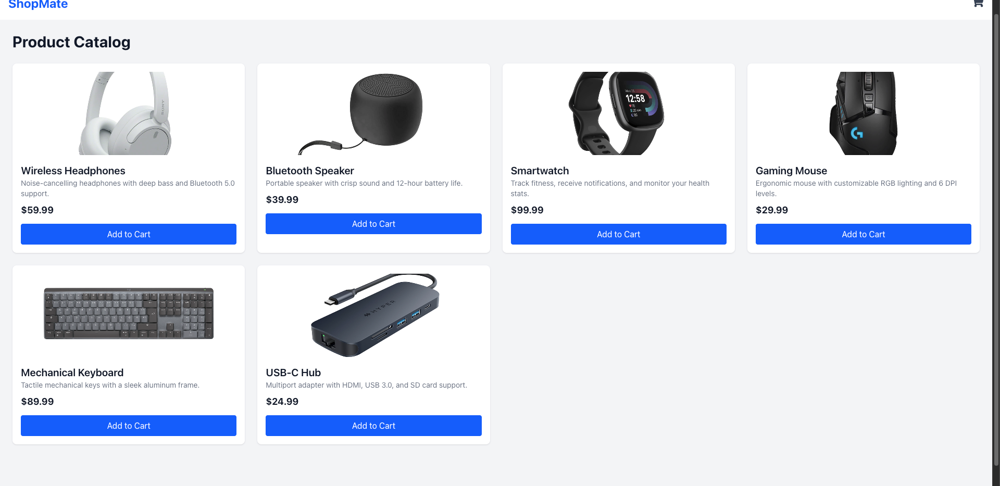

# React + TypeScript + Vite + json-server


Build a shopping UI with Vite, React, Json-Server and Tailwind

# 1 About the project

It's a simple Shopping Cart UI who be managed by using context and localStaorage for the persistance of cart data and also used a json server to simulate a API, to return json data at some endpoints. Using Tailwing for UI and styling.

# 2 How lauch the project ?

- clone the repository
  git clone "url_repository.git"

- Install dependencies
  npm i

- Lauch server-json in a terminal
  npm run json-server

- Lauch the client side

```
  npm run dev
```
